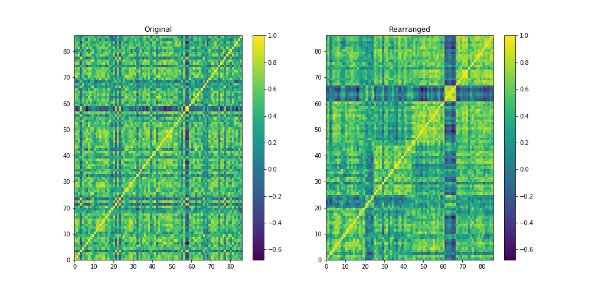

# Case study: Scotch Whisky Classification

Scotch whisky is prized for its complexity and variety of flavors and the regions of Scotland where it is produced
are believed to have distinct flavor profiles.

In this case study, we will classify scotch whiskies based on their flavor characteristics.
The dataset we'll be using contains a selection of scotch whiskies from several distilleries, and we'll attempt to cluster whiskies into groups that are similar in flavor.

The dataset used consists of tasting ratings of one readily available single malt scotch whisky
from almost every active whisky distillery in Scotland.
The resulting dataset has 86 malt whiskies that are scored between 0 and 4 in 12 different taste categories.
The scores have been aggregated from 10 different tasters.
The taste categories describe whether the whiskies are sweet, smoky,
medicinal, spicy, and so on.

Spectral co-clustering is applied to reorder the correlation matrix sp that the blocks representation of groups whiskies are more clear. Also, it used Bokeh, an interactive visualization library that provides elegant, concise construction of graphics, and affords high-performance interactivity over datasets.

  

